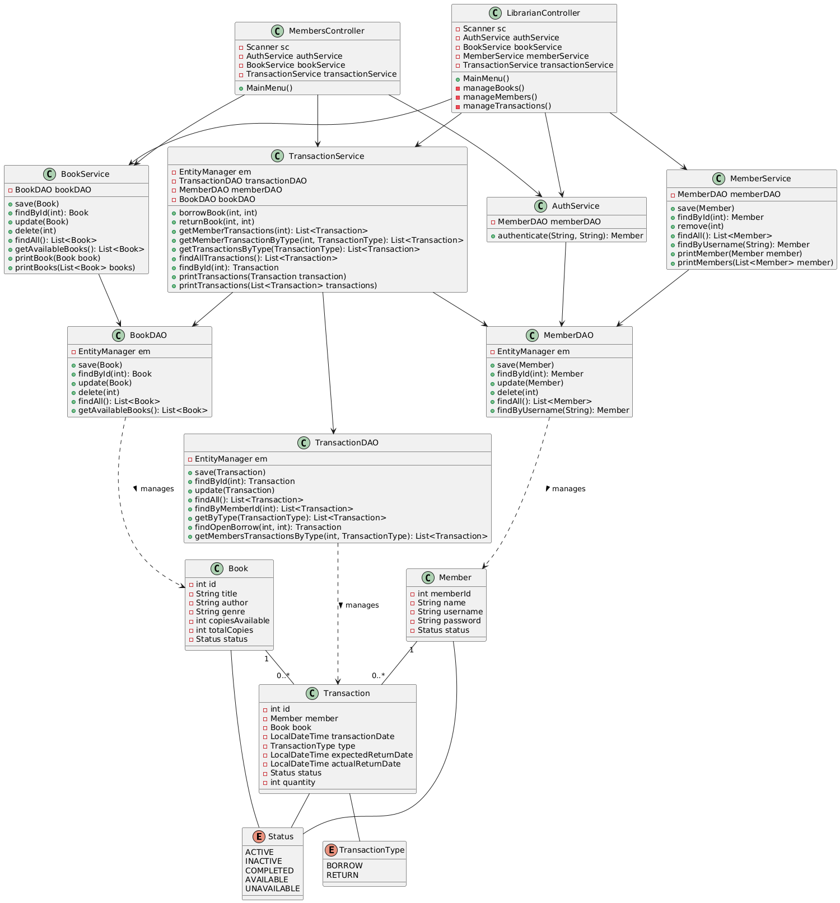

# Library Management System

A robust Java-based Library Management System that helps librarians and members manage books, transactions, and memberships effectively.

## Diagrams

### Class Diagram

### Database Model

## Features

### Authentication
- Separate login systems for librarians and members
- Secure password-based authentication
- Role-based access control

### Librarian Features
1. Book Management
    - Add new books to the library
    - Update book stocks
    - Delete books from the system
    - View all books in the library

2. Member Management
    - Add new members
    - Delete existing members
    - View all members
    - Search members by ID
    - Search members by username

3. Transaction Management
    - View all transactions
    - View transactions by member
    - Filter transactions by type (BORROW/RETURN)
    - Filter transactions by status
    - Look up transaction details by ID

### Member Features
- Borrow books
- Return books
- View personal transaction history
- Check book availability

### Transaction System
- Automatic due date calculation
- Late return detection
- Status tracking (ACTIVE/COMPLETED)
- Transaction history maintenance

## Technical Requirements

### Prerequisites
1. Java Development Kit (JDK) 24 or higher
2. PostgreSQL Database Server
3. Maven 3.6 or higher

### Dependencies
- Hibernate Core 5.6.15.Final
- PostgreSQL Driver 42.6.0
- JPA API 2.2

### Database Configuration
1. Create a PostgreSQL database and name it as "LibraryPU" for seamless access to database or else for using existing database, kindly change the name of the database `EntityManagerFactory emf = Persistence.createEntityManagerFactory("<DATABASE_NAME>");` in Main.java (line no:20)
2. Configure database connection in `persistence.xml`:
    - Database URL
    - Username
    - Password

## Installation and Setup

1. Clone the repository:
2. Navigate to the project directory:
3. Install dependencies using Maven:
4. Set up the database:
   - Update `persistence.xml` with your database credentials

5. Run the application:
   Compile and run `Main.java` using your IDE (VS Code or IntelliJ) or the terminal:

## Database Schema

The system uses the following main entities:
- Books (storing book information)
- Members (storing member details)
- Transactions (tracking borrows and returns)

## Security Features

- Password-protected access
- Role-based authorization
- Session management
- Input validation

[GitHub Profile](https://github.com/yourusername)

